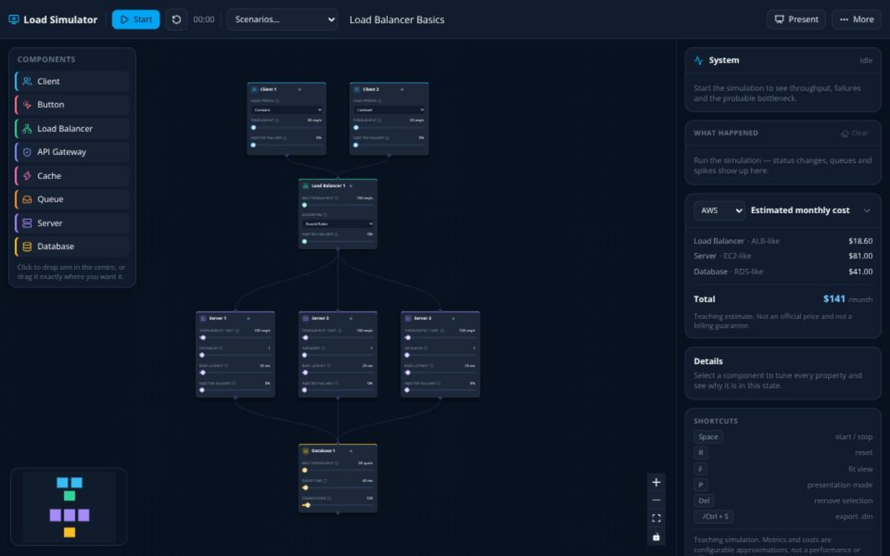

# System Design Load Simulator

**Draw an architecture. Push load through it. Watch the bottleneck appear.**

[](https://github.com/GustQueiroz/Load-Simulator/actions/workflows/ci.yml)
[Live demo](https://loadsimulator.vercel.app/) · [Português](README.pt-BR.md)



A component-level simulator for teaching and presenting System Design. You
compose a diagram, press play, and every component reacts in real time —
throughput, utilization, latency, queues, failures, and a rough monthly bill.
Change a slider mid-run and the consequence is immediate.

It exists to answer questions like these in under twenty seconds, visually:

- What happens if traffic triples?
- Why does a load balancer help — and why do three servers *not* fix a small database?
- How much does a 90% cache hit rate really take off the database?
- What does a queue do during a burst, and how long until it drains?
- Why does rate limiting protect the service instead of just moving the problem?

> **A teaching simulator, not a load tester.** No real traffic is generated
> against anything. Metrics and costs are configurable approximations, never a
> performance guarantee or a billing estimate.

## Quick start

```bash
npm install
npm run dev      # http://localhost:3008
```

No backend, no database, no accounts — it is a static site. Your work is kept
in `localStorage` and can be exported as a `.din` file (versioned JSON).

| Script | |
| --- | --- |
| `npm run dev` | development server |
| `npm test` | engine and serialization tests (headless, ~1s) |
| `npm run verify` | typecheck + lint + architecture + test + build |
| `npm run build` | static export into `out/` |
| `npm run preview` | serve the built export locally |
| `npm run perf` | tick latency, JS weight and browser FPS |

## Components

| | Models |
| --- | --- |
| **Client** | Traffic source. Constant rate, linear ramp, or timed spike. |
| **Button** | Click to fire N requests; optional automator, rate limit and cooldown. |
| **Load balancer** | Capacity and distribution across healthy targets: round robin, weighted, least-load, random. |
| **API gateway** | Rate limiting, authentication overhead, throttling at the edge. |
| **Server** | Capacity per instance × instances, bounded queue, timeout. |
| **Cache** | Hit rate — only misses continue downstream. |
| **Message queue** | Ingress and delivery rates, backlog in messages, drain ETA. |
| **Database** | Throughput *and* a connection pool ceiling (Little's law). |

Six ready-made scenarios ship with it, including the classic
`2 clients → balancer → 3 servers → 1 small database`, which puts the servers
comfortably in the green while the database goes critical. There is also a
`Button → server → database` lesson for click-driven demos.

## The exercise path

Beyond the sandbox there is a **guided course: 16 exercises across four
worlds**, unlocked in order. Open it with **Path** in the toolbar, or link
straight to one with `?lesson=1.3`.

| World | | |
| --- | --- | --- |
| **0 — Controls** | 2 lessons | Play, pause, one slider. The diagram is already built. |
| **1 — Capacity** | 5 lessons | Server, load balancer, cache, gateway and queue, one idea at a time. |
| **2 — Incidents** | 5 lessons | Missions: a briefing, locked traffic, and an architecture to fix. |
| **3 — Trade-offs** | 4 lessons | Cost, headroom and latency pulling against each other. |

Worlds 0–1 are *guided*: a coach balloon points at the control you need and
advances when you have done the thing. Worlds 2–3 are *missions*: you get a
situation, an objective and constraints — and the traffic sliders are locked,
so the only way through is to change the architecture.

Each exercise states a machine-checkable goal ("hold the database out of
critical for 3 seconds"), and awards up to three stars for the quality of the
solution — usually cost or headroom, never speed.

Writing one is data, not code: [`docs/lessons.md`](docs/lessons.md).

## How the numbers work

Everything is a **rate**. There is no object per request, so 100.000 req/s
costs the same to simulate as 10 req/s. Each tick (100 ms) the whole graph is
evaluated once, in topological order, producing one complete frame.

Some rules are exact product decisions:

| | |
| --- | --- |
| Status | `< 60%` normal · `60–80%` warning · `≥ 80%` critical |
| Utilization | `incoming / capacity`, never clamped — 340% is a number you should see |
| Determinism | no `Math.random` in the engine; the same diagram replays identically |
| Cycles | synchronous cycles are rejected, so a frame is always one deterministic pass |

Others are deliberate teaching approximations: latency climbing toward
saturation, failures appearing past 80% utilization, a connection pool acting
as a second capacity ceiling. **[`docs/simulation-model.md`](docs/simulation-model.md)
documents every one of them** — including what is intentionally missing, and
why.

One rule worth knowing up front: an edge means *"calls"*. A server wired to
both a cache and a database calls both. If you meant "read through the cache",
wire `server → cache → database`.

## Architecture

Four layers, dependencies pointing inward. `domain` and `application` contain
no React, no DOM and no timers — which is why the full test suite runs headless
in about a second.

```
domain/          types, config, metrics, graph, rules — zero dependencies
application/     engine, 7 simulators, cost, .din, presets
infrastructure/  Zustand store, localStorage, file I/O
features/        React. The only layer that knows React Flow.
```

Three invariants hold it together: the engine is pure TypeScript, there is
exactly one scheduler, and metrics never live on the nodes. See
[`docs/architecture.md`](docs/architecture.md).

## Extending it

Adding a component type starts by adding one entry to `NodeKind` — then
`npm run typecheck` prints the list of everything left to do, because every
registry is keyed by kind. A full worked example (a CDN, from empty file to
green build) is in [`docs/adding-a-component.md`](docs/adding-a-component.md).

Adding a configuration knob is a single line: card and details panel both
render from the same declaration, and a test fails if the key does not exist on
the config.

## Language

The interface ships in **English and Portuguese**. It follows the browser on
first visit, remembers your choice, and can be pinned with `?lang=en` or
`?lang=pt-BR` — handy when sharing a demo link with a specific audience.

Component names you type are data, not interface: switching language never
renames the nodes you created.

## Shortcuts

`Space` start/stop · `R` reset · `F` fit view · `P` presentation mode ·
`Del` remove selection · `⌘/Ctrl+S` export `.din` · `⌘/Ctrl+O` import ·
`Esc` leave focus

Presentation mode strips every editing affordance — handles, palette, node
actions — and leaves the diagram, the metrics and a presenter toolbar.

## Roadmap

Not implemented yet, and organised so each fits without rewriting the engine:
retry storms, autoscaling with delay and cooldown, circuit breakers, health
checks, read replicas, sharding, stream partitions, CDN, PNG export and A/B
snapshots.

Recently landed: load timelines (ramp/spike), clickable Button source,
event log, and shareable URLs (`#d=…` / `?preset=`).

Contributions welcome — start with [CONTRIBUTING.md](CONTRIBUTING.md).

## License

[MIT](LICENSE).
